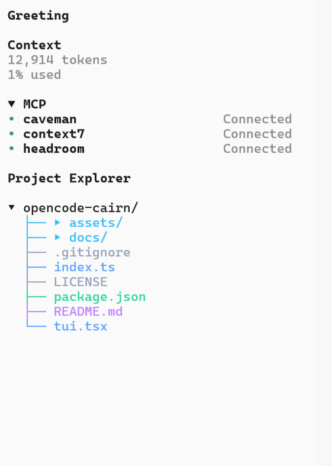
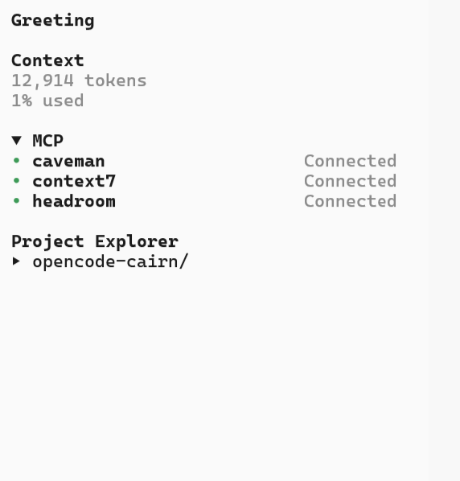

# opencode-cairn

[](./LICENSE)
[](https://opencode.ai)
[](#prerequisites)

**Project Explorer sidebar panel for the [opencode](https://opencode.ai) TUI** — a colorful, collapsible file tree that lives beside the MCP section, so the shape of your project is always one glance away.

> **Cairn** (n.) — a small pile of stones that marks the trail. This plugin marks yours through the codebase.

## Visual Overview

**Expanded — color-coded tree with guide lines:**



**Collapsed — one line until you need it:**



## Presentation

Interactive 8-slide deck for demos — live web view:

[](https://amy220478.github.io/opencode-cairn/presentation.html)

Local copy ships in-repo (`presentation.html`) — open it in a browser (double-click or `start presentation.html`), then `← → / space`, `T` theme, `P` print-to-PDF. Keep `./assets/` alongside.

## Core Features

Persistent sidebar tree, per-folder `▸/▾` expand/collapse with classic `├──` / `└──` guide lines, color-coded file types (folders sky-blue; `ts` blue, `js` yellow, `json/yaml` green, `md` purple, `html/css` orange, media pink, configs gray), click-to-toggle folders, click-to-open files in the OS default app, full keyboard + command-palette control (works over SSH where mice don't), auto-shows on launch with state persisted across restarts, and zero runtime dependencies.

## Prerequisites

**Supported OpenCode version:** v2.x — tested on **v2.0.18**. Uses the v2 TUI plugin API (`@opencode/plugin/tui` slots). Not compatible with the v1 agent-plugin format.

**Recommended runtime:**

- Standard OpenCode v2 plugin environment (Bun-powered TUI)
- No `bun install` / build step — the plugin is two source files loaded directly by OpenCode
- Peer APIs provided by the host at runtime: `@opencode/plugin >= 2.0.0`, `@opentui/solid >= 0.5.0`

**Tested platforms:** Windows (primary). macOS (`open`) and Linux (`xdg-open`) paths are implemented for click-to-open but await community confirmation — please report your terminal + OS in an issue.

## Getting Started

Copy the plugin folder into your global opencode plugins directory, then restart the TUI:

```powershell
# Windows
Copy-Item -Recurse ./opencode-cairn "$env:USERPROFILE/.config/opencode/plugins/opencode-cairn"
```

```sh
# macOS / Linux
cp -r ./opencode-cairn ~/.config/opencode/plugins/opencode-cairn
```

**Windows:** the config home is `%USERPROFILE%\.config\opencode` (for example `C:\Users\<you>\.config\opencode\plugins`). This plugin does **not** read `%APPDATA%` for its entry — put the folder under `.config\opencode\plugins` in your user profile, then restart OpenCode.

Verify it loaded:

```sh
opencode --print-logs plugin list
# cairn.server  local  .../plugins/opencode-cairn/index.ts
```

The **Project Explorer** panel appears in the sidebar on first launch — no setup command needed.

## How to use day-to-day

You do **not** need to run anything for the plugin to work. With the defaults, the tree follows your current project and remembers its state.

### Typical daily flow

1. Install (see [Getting Started](#getting-started)) and restart OpenCode.
2. Work normally. Click a `▸` folder (or `/cairn pick`) to drill in; click a file to open it.
3. Collapse what you don't need (`/cairn all collapse`) on huge repos; `/cairn reset` restores a clean default any time.

### Click vs keyboard

| Approach | When it works | What you do |
|---|---|---|
| **Mouse** (best-effort) | Terminals with mouse reporting | Click folder to toggle, file to open |
| **Keyboard/palette** (guaranteed) | Everywhere, incl. plain SSH | `/cairn pick`, palette `Cairn: …` commands |

Mouse delivery to plugin slots depends on the host/terminal; the palette path always works.

## Commands

| Action | Slash | Palette |
|---|---|---|
| Show / hide panel | `/cairn` | Cairn: Toggle project explorer panel |
| Collapse / expand pane | `/cairn collapse`, `/cairn expand` | Cairn: collapse/expand pane header |
| Toggle a folder | `/cairn toggle <path>` | Cairn: expand/collapse selected folder |
| Pick a folder | `/cairn pick` | Cairn: pick folder to expand/collapse |
| Move selection | `/cairn next`, `/cairn prev` | Cairn: move selection up/down |
| Expand / collapse all | `/cairn all`, `/cairn all collapse` | Cairn: expand/collapse all folders |
| Open file in editor | `/cairn edit [path]` | Cairn: open selected file in editor |
| Fresh start | `/cairn reset` | — |
| Help | `/cairn help` | — |

Show a subtree at custom depth: `/cairn src 2`

## Configuration essentials

No config file needed. State lives in durable `cairn.params` storage (survives restarts and hot reloads):

| Key | Default | Effect |
|---|---|---|
| `visible` | `true` | Panel shows without any command |
| `root` | `""` (= current project) | Pin with `/cairn <path>`; empty always follows you |
| `depth` | `3` | Max levels rendered (1–10 via `/cairn <n>`) |
| `paneCollapsed` | `false` | Whole-pane collapse |
| `expanded` | top-level dirs | Per-folder open set |
| `selected` | `""` | Cursor position |

Skipped everywhere: `node_modules`, `.git`, `dist`, `dist-electron`, `graphify-out`. Sidebar renders ~34 characters wide; deep paths truncate with `…`.

"Open in editor" uses the OS file association (`start` / `open` / `xdg-open`), not `$EDITOR` — set the Windows association once and clicks follow it.

## Uninstall

```powershell
# Windows
Remove-Item -Recurse -Force "$env:USERPROFILE/.config/opencode/plugins/opencode-cairn"
```

```sh
# macOS / Linux
rm -rf ~/.config/opencode/plugins/opencode-cairn
```

Restart the TUI. Stored panel state (`cairn.params`) is discarded with the host storage on uninstall.

## Development & Contribution

The plugin is two files — `index.ts` (server stub) and `tui.tsx` (the panel). Test loop: copy the folder into your local plugins dir and reload the TUI.

```
# no build step — edit, copy, reload
cp -r ./opencode-cairn ~/.config/opencode/plugins/opencode-cairn
```

PRs welcome — especially real-terminal screenshots, performance notes on huge trees, and mouse-behavior reports per terminal/OS. Open a PR describing terminal + OS tested on; we review quickly.

## License & Links

MIT License — see [LICENSE](./LICENSE)

- **Repository**: <https://github.com/amy220478/opencode-cairn>
- **Issues**: <https://github.com/amy220478/opencode-cairn/issues>
- **OpenCode Platform**: <https://opencode.ai>
